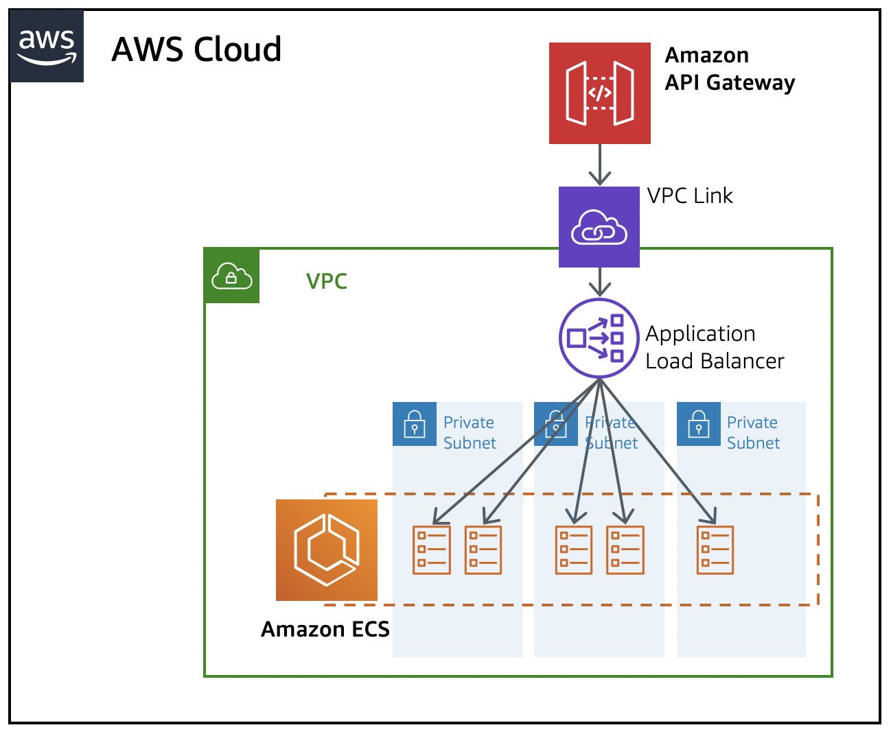

# fng-api-poc

A repo to prototype the fng api env.

# build and run locally (in docker)

`docker build -t playground:dev .`
`docker run -d --name playground -p 9000:8000 playground:dev`

# next steps
1. automate infrastructure into k8s (cloudformation)
2. improve project structure (packages)
3. automate ci (circleci)

# Architecture
